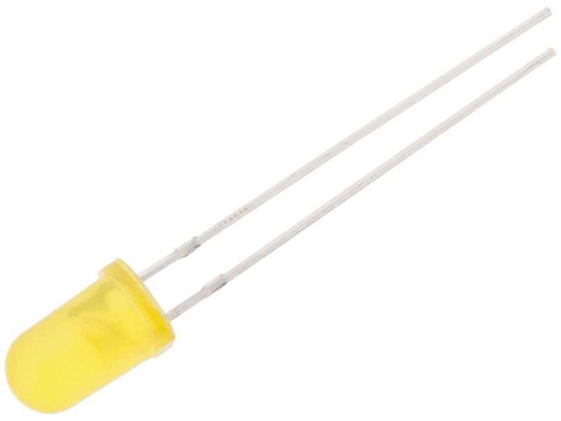
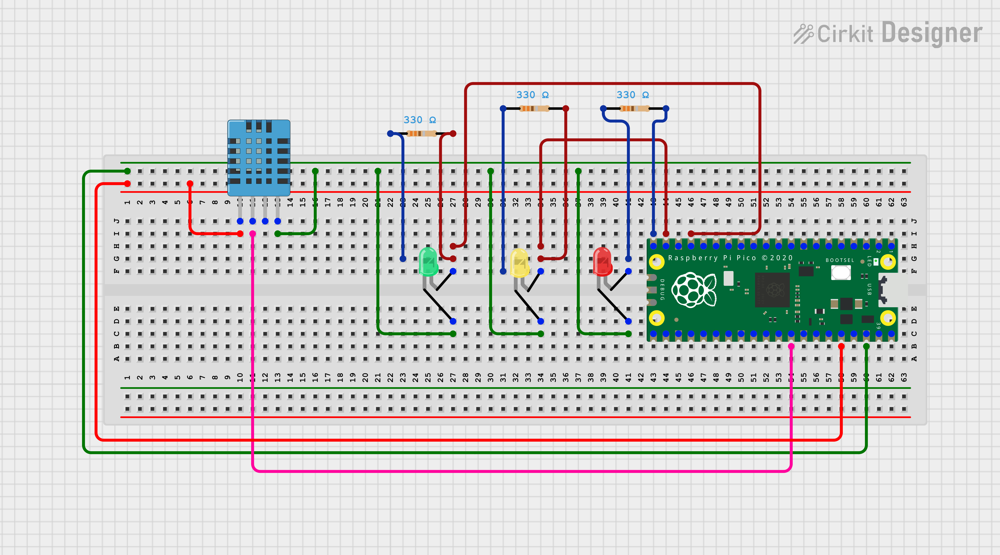
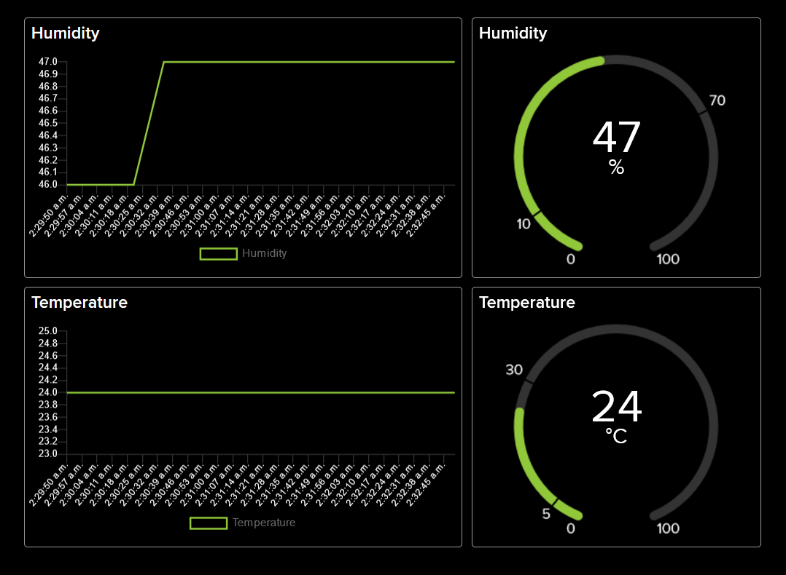
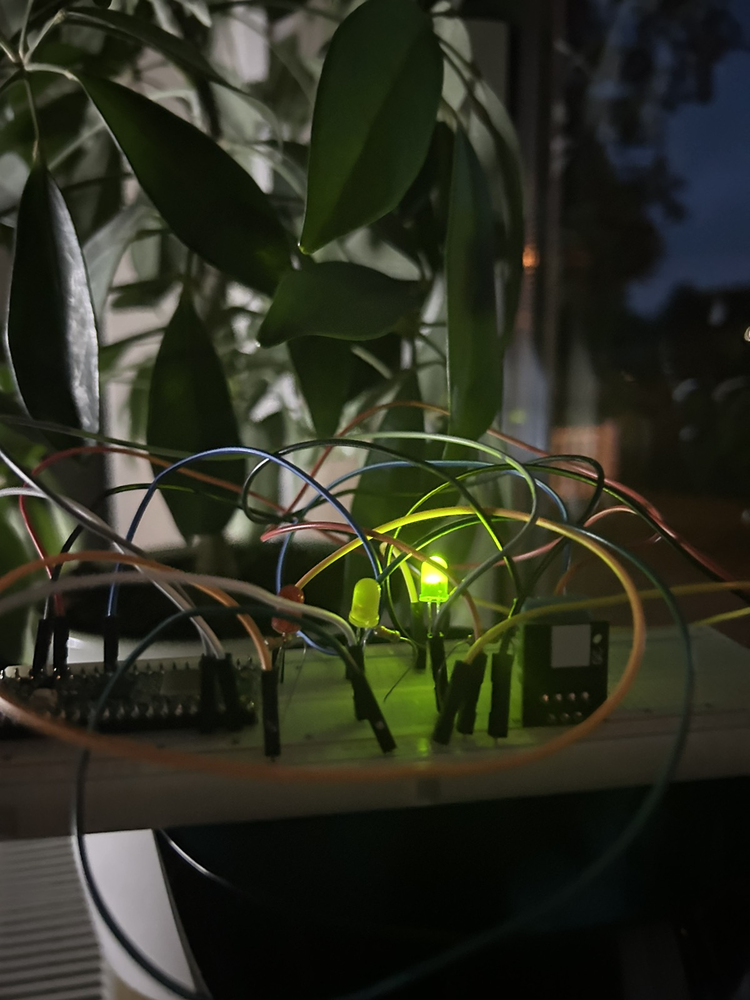

# IoT-TempHumidity-Monitor
This is the project presented for the applied IoT course.

## Overview

**Name**: Fabian Dacic

**Student credentials**: fd222fr

`IoT-TempHumidity-Monitor` is an IoT system built using MicroPython for Raspberry Pi Pico WH, designed to monitor and evaluate environmental conditions. The system reads temperature and humidity data from a DHT11 sensor, evaluates the data, and provides immediate visual feedback through LEDs. The collected data is also sent to Adafruit IO for visualization and tracking.

**Time to Complete**: Approximately 5-10 hours depending on experience and equipment.

## Objective

The objective of this project was to create an environment monitoring system that not only provides real-time data to users but also visualizes this data immediately on the device itself, and this immediate feedback can help users take quick actions in case of adverse conditions. The data sent to Adafruit IO allows users to track environmental conditions over time, offering valuable insights into patterns and trends. I chose this project due to the tools that I had at my disposal (starter kit), and after different IoT project inspiration websites such as [upgrad's one](https://www.upgrad.com/blog/iot-project-ideas-topics-for-beginners/) and consulting colleagues, a temperature and humidity monitor seemed to be one of the projects that could properly utilize the starter kit. The purpose that it will serve is probably as a base for more advanced projects than a mere monitor and an entry to beginners in IoT. The insights that can be gained from this project are of various aspects such as knowledge about IoT systems in general and the equipment, data visualization, real-time monitoring or in other words considering it allows one to monitor temperature and humidity in real-time, this is particularly useful when it comes to applications such as: greenhouse management, home climate control, etc. Although there are rudimentary alerting and notification measures set in the form of LEDs, the system can be definitely upgraded to a more sophisticated notification system depending on temperature and humdity. These are just a few of the many aspects that this project can aid in.

## Material

### List of Material and Specifications

| No. | Name | Store Identification | Quantity | Approximate Price per Piece (SEK) |
|---|---|---|---|---|
| 1 | Raspberry Pi Pico WH | 41019114 Raspberry Pi Pico WH | 1 | 109 |
| 2 | Breadboard 840 connections | 10160840 Kopplingsdäck 840 anslutningar | 1 | 69 |
| 3 | USB Cable A Male – Micro B 5P Male 1.8m | 41003290 USB-kabel A-hane – micro B 5p hane 1.8m | 1 | 39 |
| 4 | Jumper Cable 30cm Male/Male | 41012684 Labbsladd 30cm hane/hane | 11 | 49 |
| 5 | Carbon Film Resistor 0.25W 330 Ohm | 40810233 Motstånd kolfilm 0.25W 330ohm (330R) | 3 | 1 |
| 6 | Red LED 5mm Diffuse 1500mcd | 40307020 LED 5mm röd diffus 1500mcd | 1 | 5 |
| 7 | Yellow LED 5mm Diffuse 1500mcd | 40307021 LED 5mm gul diffus 1500mcd | 1 | 5 |
| 8 | Green LED 5mm Diffuse 80mcd | 40307023 LED 5mm grön diffus 80mcd | 1 | 5 |
| 9 | Digital Temperature and Humidity Sensor DHT11 | 41015728 Digital temperatur- och fuktsensor DHT11 | 1 | 49 |

All of these components were bought from Electrokit as a part of the Starter Kit for the IoT course which cost 399SEK.
- **Raspberry Pi Pico WH**: This is the main microcontroller used in the project. It features an ARM Cortex-M0+ CPU, 256kB of RAM, 30 GPIO pins, 2MB on-board QSPI Flash, and has a CYW43439 wireless chip that supports IEEE 802.11 b/g/n wireless LAN.
- **Breadboard**: A breadboard is used to create the circuits for the project in a non-permanent way. It provides 840 tie points for convenient circuit building and modifications.
- **USB Cable A Male – Micro B 5P Male**: This cable is used to connect the Raspberry Pi Pico WH to the computer for programming.
- **Jumper Cables (Male/Male)**: These cables are used to make connections on the breadboard between different electronic components.
- **Carbon Film Resistor (0.25W, 330 Ohm)**: These resistors are used in series with the LEDs to limit the current flowing through them and prevent them from burning out.
- **Red LED**: Used to visually indicate dangerous environmental conditions based on the sensor data in this specific contenxt.
- **Yellow LED**: Used to visually indicate middle-ground environmental conditions based on the sensor data in this specific context.
- **Green LED**: A Green LED that's used to visually indicate safe environmental conditions based on the sensor data in this specific context.
- **Digital Temperature and Humidity Sensor (DHT11)**: This sensor measures both temperature and humidity, and it provides digital output accordingly. 

<div align="center">
  <div style="display: flex; justify-content: space-between;">
    <figure style="display: flex; flex-direction: column; align-items: center;">
      
      <figcaption>Figure 1.0: Red LED</figcaption>
    </figure>
    <figure style="display: flex; flex-direction: column; align-items: center;">
      
      <figcaption>Figure 1.1: Yellow LED</figcaption>
    </figure>
    <figure style="display: flex; flex-direction: column; align-items: center;">
      
      <figcaption>Figure 1.2: Green LED</figcaption>
    </figure>
  </div>
  <figure style="display: flex; flex-direction: column; align-items: center;">
    
    <figcaption>Figure 1.3: DHT11 Sensor</figcaption>
  </figure>
  <figure style="display: flex; flex-direction: column; align-items: center;">
    
    <figcaption>Figure 1.4: Raspberry Pi Pico</figcaption>
  </figure>
</div>

## Computer Setup

The device was programmed using Thonny (the link to download it is [here](https://github.com/thonny/thonny/releases/download/v4.0.2/thonny-4.0.2.exe)). To flash the firmware and upload the code to the Raspberry Pi Pico, the steps as described in the MicroPython / course documentation were followed.     
To begin with, 
- **Download the Firmware**: Start by downloading the latest version of the UF2 file for the Raspberry Pi Pico from the MicroPython website under the 'Releases' category.
- **Connect the Raspberry Pi Pico**: Connect the smaller end of the micro USB cable into the Raspberry Pi Pico. While you are doing this, make sure you hold the back of the USB slot firmly to avoid any damage.
- **Enter Bootloader Mode**: Probably the "trickiest" part, but hold down the 'BOOTSEL' button on your Raspberry Pi Pico. While holding it down, plug the other end of the USB cable into your computer. You can let go of the button after plugging it in.
- **Flash the Firmware**: Your Raspberry Pi Pico should appear on your computer as a USB drive named 'RPI-RP2'. Drag and drop (or copy/paste) the UF2 file you downloaded earlier into this drive.
- **Wait for Flashing to Complete**: The Pico will start flashing the firmware. During this process, the Pico will disconnect and then reconnect to your computer. Make sure you do not unplug the device during this process.

Now, if Thonny has been installed, next step is trying out if the process was successful and code uploading to the device. Therefore,

- **Open up** Thonny on your computer. If you haven't installed it yet, you can download it from the aforementioned link.
- **Configure** Thonny for the Raspberry Pi Pico: Once you have Thonny open, navigate to 'View >> Files' to open the file manager panel. After that, go to 'Run >> Configure interpreter...'. In the interpreter settings, select 'MicroPython (Raspberry Pi Pico)'.
- **Interacting** with the Raspberry Pi Pico via Thonny: Now you should see your Pico's REPL (Read-Eval-Print Loop) interface in Thonny. This is an interactive environment where you can type commands and see the output directly. For instance, you can type print('Hello, LNU!') and see your board print this to the serial port.
- **Upload Code**: You are now ready to write and upload your code. Either open an existing Python file or write your new MicroPython code right in Thonny. To upload the code to the Pico, simply click on the 'Run' button. Thonny will take care of the rest, automatically uploading the code and running it on the Pico.

## Putting Everything Together



The task to begin with was to interconnect various electronic components, centering around the Raspberry Pi Pico WH, our main microcontroller. The ground (GND) pin, or pin 38, was the first one to get my attention - it's directly wired to one edge of the breadboard, serving as the common grounding point for other components. Next, the 3.3V output (pin 36) of the Pico is tethered to the opposite edge of the breadboard. It essentially lights up the entire circuit, providing the power supply. The DHT11 sensor, responsible for tracking temperature and humidity, is linked to the Pico's GP27 pin (pin 32) directly. The sensor's second pin is hooked up to the 3.3V column on the breadboard, while the third pin is connected to the common grounding point. It's an elegant little setup, ensuring gatherings of accurate readings of the environment. The LEDs, glowing indicators of environmental conditions, are wired in a slightly more intricate pattern. I have three LEDs: red, yellow, and green. Each one is paired with a 330 Ohm resistor, a necessity to prevent an overflow of current that might otherwise harm the LEDs. For each LED, the anode (longer leg) is connected to the Pico via its respective GPIO pin through a resistor. The cathode (shorter leg) is then routed back to the common GND column on the breadboard. Though this process might seem detailed, it's crucial to remember the end goal: ensuring each component is connected to the correct GPIO and power supply pins on the Pico, to avoid any short circuits. Also, because LEDs are polarized, they need to be connected in the right orientation.

## Platform

Adafruit IO was chosen to be the platform of choice. While there were numerous options to consider, ranging from local servers to various cloud-based IoT platforms, this specific platform stood out for several reasons. Firstly, the platform was covered in the course, so it made perfect sense to take advantage of that knowledge. Moreover, it is designed with simplicity and user-friendliness at its core, making it an ideal choice for beginners as well as advanced users. In other words, it has a really smooth learning curve. Adafruit IO is a cloud-based platform, meaning that it leverages the power of internet connectivity to let one access, manage, and visualize the data from anywhere, at any time. This removes the need to maintain a local server and provides a scalable, flexible solution that's ideal for an IoT project of this nature. In terms of costs, a free account was utilized for this specific project which offered a decent amount of functionality to get started. The free tier includes access to a limited number of dashboards and data points per minute, which was sufficient considering the scale of the project. However, should the need arise to scale up the project – say, to monitor multiple rooms or locations simultaneously – Adafruit IO also offers a Plus subscription. When it comes to functionality, Adafruit IO shines with its intuitive, easy-to-use dashboards, real-time data monitoring, and simple API. Additionally, an important aspect that made Adafruit IO the platform of my choice is its support for MQTT (Message Queuing Telemetry Transport). MQTT is a lightweight publish-subscribe based messaging protocol that's designed for resource-constrained devices and low-bandwidth, high-latency networks - making it perfect for IoT applications.

## The Code

The code is split into four Python files:

1. `boot.py`: Handles and tests the internet connectivity and turns off all LEDs to begin with. In slightly more detail, the script connects to a Wi-Fi network, makes an HTTP GET request to example.com (checks the status as well), and tests the LEDs (lights them up one by one and then switch off completely).
2. `led.py`: Manages the LED status based on temperature and humidity data. One of the key features in this script is the set_leds_based_on_temperature_and_humidity(temperature, humidity) function. Here, the function uses the temperature and humidity data, passed as parameters, to decide which LED should be turned on.

```
  def set_leds_based_on_temperature_and_humidity(temperature, humidity):
      if temperature > 30 or humidity > 70:
          # High temperature/humidity: turn on red LED, turn off other LEDs
          set_led(1, 0, 0)
      elif temperature < 5 or humidity < 20:
          # Low temperature/humidity: turn on red LED, turn off other LEDs
          set_led(1, 0, 0)
      elif 15 <= temperature <= 25 and 40 <= humidity <= 60:
          # Normal temperature/humidity: turn on green LED, turn off other LEDs
          set_led(0, 0, 1)
      else:
          # Starting to get dangerous: turn on yellow LED, turn off other LEDs
          set_led(0, 1, 0)
```
In essence, the logic behind these values is to create a visible alert system that lets one know when environmental conditions are becoming harmful to both people and equipment.

- The **Red LED** turns on when the temperature is above 30 degrees Celsius or humidity is above 70%. This is generally considered uncomfortable for humans and potentially damaging for electronics. High humidity can lead to condensation and corrosion in electronic components. A temperature above 30 degrees Celsius could indicate a malfunctioning air conditioning system, for example, which can harm both people and some electronics. The Red LED also turns on when the temperature drops below 5 degrees Celsius or humidity is below 20%. Low temperatures might indicate that the heating system is broken, which can be uncomfortable during winter and could harm electronic devices if they get too cold. Similarly, low humidity levels can create an environment in which static electricity discharges are more likely, potentially damaging electronic equipment.

- The **Green LED**, on the other hand, turns on when the temperature is between 15 to 25 degrees Celsius and humidity is between 40 to 60%. This is considered the ideal comfort zone for humans and a safe range for most electronic devices.

- The **Yellow LED** illuminates when the temperature and humidity are outside the comfortable range, but not extreme enough to be hazardous. This serves as a warning to check your environmental control systems before the situation becomes critical.

Here's the reference for some of the these temperatures found [here](https://docs.oracle.com/cd/F14151_01/F14152/html/deploy-sitereq-temperature-humidity.html).

4. `aio.py`: Controls the connection to Adafruit IO and the publishing of data to Adafruit IO feeds.
5. `main.py`: Coordinates the overall process of reading sensor data, updating the LEDs, and publishing data to Adafruit IO.

```
  dh.measure()
  temperature = dh.temperature()
  humidity = dh.humidity()
  # Update LED status based on temperature and humidity
  led.set_leds_based_on_temperature_and_humidity(temperature, humidity)
  # Get the currently active LED
  active_led = led.get_active_led()
  # Indicate publishing by toggling the active LED
  toggle_led(active_led)
  # Send data to Adafruit IO
  aio.send_data(temperature_feed_key, temperature)
  aio.send_data(humidity_feed_key, humidity)
  # Toggle the active LED back
  toggle_led(active_led)
```

7. `lib/mqtt.py`: The library used in the course for MQTT API. It defines an Message Queue Telemetry Transport (MQTT)  client for microcontrollers that support MicroPython. MQTT is a lightweight messaging protocol that uses publish/subscribe operations to exchange data between clients and an MQTT broker. The MQTTClient class encapsulates the behavior of an MQTT client, which can connect to an MQTT server (broker), publish messages to a topic, and subscribe to a topic to receive messages. MQTT is used in this context because it's an extremely lightweight messaging protocol, designed for low-bandwidth, high-latency, or unreliable networks. It is particularly useful in IoT (Internet of Things) applications because, as mentioned before, these applications often involve a multitude of devices, many of which are constrained by power or network availability.

9. `lib/secrets.py`: Think of it as a dotenv file, meant to store secret variables that can be called in the code such as the Wi-Fi SSID, password, the feed keys, etc.

## Transmitting the Data / Connectivity
The data is sent to Adafruit IO feeds using MQTT protocol over Wi-Fi, and the temperature and humidity data are sent over to Adafruit IO every 15 seconds. To go into more depth, the program starts by taking readings from sensors connected to the device. In this instance, it is the temperature and humidity from the DHT11 sensor and this raw data is read into the device using some form of interface and the code processes this raw data into useful information. This data is then ready to be sent out over the internet. To do that, in this project, the device uses Wi-Fi to connect to a local network that has access to the internet. Once your device is connected to the internet, it needs to send its sensor data to a specific server where it can be stored, processed, or analyzed. This is done using MQTT (Message Queuing Telemetry Transport), a protocol designed for lightweight data transmission from devices like yours.

Here's how (roughly) MQTT works:
- The device, now an MQTT 'client', establishes a connection with an MQTT 'broker'. The broker is addressed using its IP address or domain name, and connection is typically established over a specific port (io.adafruit.com, 1883 for example).
- The device sends an MQTT 'publish' message to the broker, with the sensor data embedded in the message payload. Each message has a 'topic', which is like an address for where the message should go.
- The broker receives the publish message and forwards it to any clients that have previously expressed interest in the message's topic. This is known as 'subscribing'.
- In this case, the broker is hosted by Adafruit IO, an Internet of Things (IoT) platform that makes it easy to store and visualize your sensor data.

Regarding the frequency of data transmission, it is decided the variable `transmission_interval` found in **main.py**. The code is set up to take sensor readings and send the data over MQTT at those regular intervals. In summary, the journey of the sensor data from the device to the server involves: **sensor reading** -> **Wi-Fi connection** -> **MQTT publish** -> **Internet** -> **MQTT broker** -> **end client subscribed to the topic**.

## Presenting the Data
The data is presented on Adafruit IO dashboard where it can be visualized and monitored in real-time.
There are two feeds for humidity and temperature, and a dashboard that incorporates the two.



The Adafruit IO dashboard is where you view and interact with the data sent from the device. Feeds are created and they are essentially storage spaces for different types of data from the device. For example, one feed could be for temperature data and another for humidity data. To visualize this data, add blocks to the dashboard. Each block is linked to a feed or a group of feeds, and presents the data in a certain way, for example, a line chart block shows a graph of data over time, while a gauge block displays the current value within a range. Adafruit IO automatically stores the data sent to each feed and in this project's context, the free account keeps the data for 30 days. The frequency at which data is stored in the database is determined by how often the device itself sends the data (in this case, every 15 seconds). This setup allows to monitor and analyze the sensor data from the device in real time, as well as track historical trends.

## Finalizing the Design

Overall, the project was a great learning experience and I was able to successfully achieve the initial goals that weere set. However, as with any project, there were areas where better decisions would have improved the overall quality of the project. It would have been nicer to have more sensors such as one for air quality or maybe even have the project more specific toward plant life with a soil moisture sensor. In terms of connectivity, Wi-Fi was chosen for its ubiquity and MQTT for its lightweight, publish-subscribe model and this combination worked well but in hindsight, it might have been interesting to explore other wireless protocols, like LoRaWAN for its long-range capabilities. This was mostly due to choosing the starter kit which does not include it... In retrospect, I believe this project has somewhat filled its purpose but also hopefully will serve as a base for far more advanced projects. The possibility of adding more sensor nodes, exploring alternative connectivity options, or integrating with other cloud platforms for advanced analytics are all promising avenues for future work. Finally, the most significant takeaway from this project is the understanding that the IoT is not a distant, abstract concept, but rather an approachable, practical field that has a myriad of applications in our everyday lives.

**Pictures**

<div align="center"> 
  
</div>
Closing words -> cable management is my passion.
